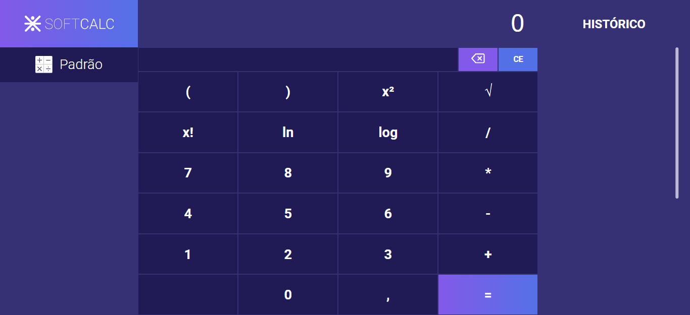

 
🔢SoftCalc é uma aplicação básica de uma calculadora, contendo um visual mais limpo e um histórico das suas operações.

## 🚀OBJETIVOS
Repositório será utilizado para fins de teste de tecnologias, para tanto, a branch main contém somente o código básico(HTML, CSS e JS) e novas Branchs serão criadas refatorando esse código utilizando as tecnologias.

## 📝Liçenca
Este repositório está sob a liçenca da [MIT LICENSE](LICENSE).  

<h2 align="center">
Desenvolvido por Reinaldo da Silva☺️
</h2>
